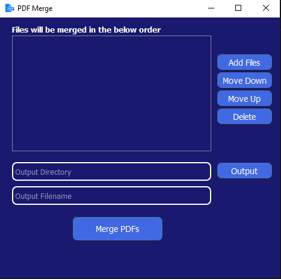

# PDFMerger

A simple PDF Merger built with Python and PyQt5.

- GUI app to interactively order and merge .pdf files
- CLI tool for quick merges from the terminal
- Accepts images (png/jpg/jpeg/bmp/tif/tiff/gif) and text (.txt) files; they are converted to PDF on-the-fly
- Uses the maintained `pypdf` backend (falls back to `PyPDF2` if needed)

Screenshot of the GUI:



## Install

Create a virtual environment (recommended) and install dependencies:

```powershell
python -m venv .venv
.\.venv\Scripts\Activate.ps1
pip install -r requirements.txt
```

If `pypdf` isn't available, the code will attempt to use `PyPDF2` if installed.

Optional: to enable .docx support, install Microsoft Word and `docx2pdf`:

```powershell
pip install docx2pdf
```

## Run the GUI

```powershell
python .\PDFMerger.py
```

Steps:
- Click "Add Files" and pick your PDFs, images, or text files (order matters)
- Choose an Output directory
- Enter an Output filename (without extension)
- Click "Merge PDFs"

If the output file exists, you'll be asked to confirm overwrite.

## Use the CLI

A small CLI script is included for quick merges:

```powershell
# Merge two files into output.pdf
python .\pdfmerge_cli.py -o .\output.pdf .\a.pdf .\b.pdf

# Overwrite the output if it exists
python .\pdfmerge_cli.py -f -o .\output.pdf .\a.pdf .\b.pdf
```

## Notes

- Supported inputs: .pdf, images (png/jpg/jpeg/bmp/tif/tiff/gif), .txt. Optional: .docx if `docx2pdf` + Microsoft Word are available (Windows only).
- Encrypted or corrupted PDFs may fail to merge; errors will be shown.
- Image-to-PDF conversion preserves image dimensions; text is rendered simply via ReportLab.
- The merge engine attempts to operate in a tolerant mode when supported.

## Development

Core logic is in `pdfmerge.py`:
- `merge_pdfs(input_files, output_path, overwrite=False)` is the recommended API
- A legacy `merge(self, readFileList, _translate)` wrapper remains for the GUI

Contributions welcome!
